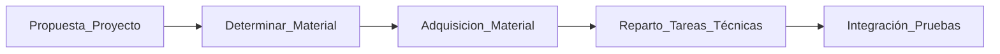

# Miembros de este proyecto
En este proyecto  somos en total 17 personas. 

Esto es un gran aliciente pues disponemos de un gran potencial para poder conseguir nuestro trabajo




Grupo coordinado avanza, no coordinado retrasa el proyecto



Pero un aspecto muy importante va a ser la coordinación y comunicación
En esta línea hemos de ser conscientes de alguno de los puntos débiles:


* No tenemos (ni debemos de tener), un horario fijo marcado para este trabajo
* Nadie nos va a pagar por este trabajo
* No tenemos (la mayoría) una experiencia realizando un proyecto como este 

  
Para solventar esta circunstancia vamos a intentar que dada uno tome responsabilidades en el aspecto que más le pueda interesar (yo voy a proponer líneas de trabajo), pero cada uno puede incluirse en la que más le interese o proponer una nueva línea de trabajo que se puede añadir o suplir otra existente

## Integrantes del grupo
Formamos este proyecto las siguientes personas


Luismi Morillas
Samuel Moreno 
Enrique Messeguer
Sofía Agustín
Lara Presa
Oscar Pelleger
Cristina Barranco
Ana Aranda
Juanjo González
Manuel Romero


Ana  Costea


Miguel Luego
Dolo  Piequeras
Almudena Hidalgo


Daniel Miranda
Dario Ruata


Pilar Megino (directora)
Irene (Jefa de estudios)
Aurelio (Jefe de departamento de informática)


Juanjo González




## Propuesta de tareas

Este apartado vamos a ir trajándolo en esta primera etapa del proyecto

```markmap
# Tareas
## Imagen y sonido
### Seguimiento de la evolución del aula (Almudena  Hidalgo)
### Vestir el aula con carteles (Almudena  Hidalgo)
### Posibles obras/modificaciones del aula (Miguel Luengo)
### Realizar un render con blender del aula (Dolo)
## Alumnos del centro
### Crear una web 
#### Seguimiento
#### Divulgación
#### Control del aula
## Idiomas
### Traducción/Revisión  de la web en idiomas
## Informática
### Gestión de presencia 
### Gestión de temperatura y humedad
### Gestión de CO<sub>2</sub>
### Gestión de luminosidad
### Integración de los sistemas
### Python como lenguaje de desarrollo (Luismi)
## Coordinación y seguimiento
### coordinación del grupo  (Manuel)
### Dinamización de tareas y del grupo (Samuel y Manuel)
### Material a adquirir (Juanjo y Manuel )
### Estudio de protocolos y decisión técnica (Juanjo y Manuel )
```




